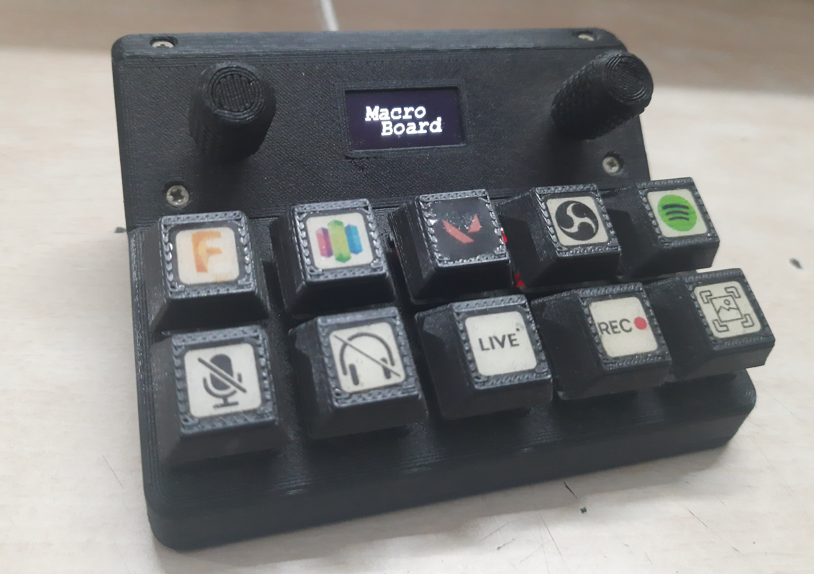

# MacroBoard
MacroBoard is a 3D Printed 10 key mechanical switch keypad with 2 rotary encoders, a buzzer, backlight and an OLED display.
Based on Atmega32U4 Microcontroller on an Arduino Pro Micro Development Board.
All of the keys can be programmed to emulate a single keypress or a combination of keys( eg: CTRL+ALT+DEL, WIN+PRTSC ).
The encoders can also be programmed to send a specific keypress (eg: volume control, media control).

